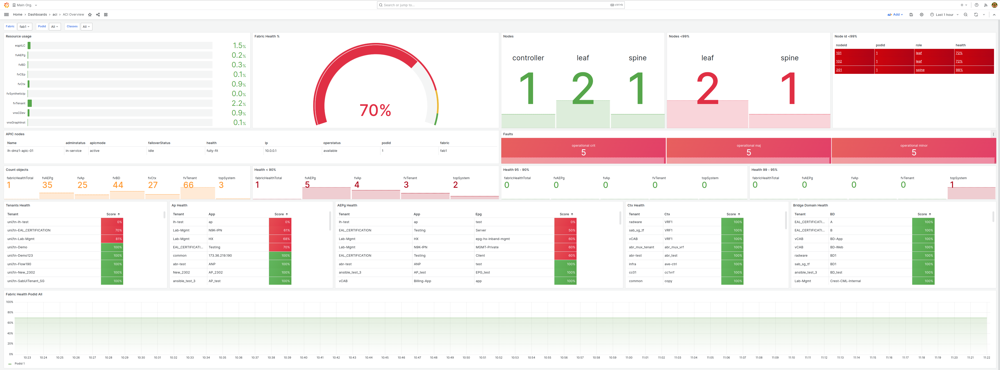

aci-exporter - A Cisco ACI Prometheus exporter
------------
[](https://developer.cisco.com/codeexchange/github/repo/opsdis/aci-exporter)

# Overview
The aci-exporter provide metrics from a Cisco ACI fabric by using the ACI Rest API against ACPI controller(s).

The exporter can return data both in the [Prometheus](https://prometheus.io/) and the 
[Openmetrics](https://openmetrics.io/) (v1) exposition format. 

The metrics that are exported is configured by definitions of a query. The query can be of any supported ACI class.



# How to configure queries
 
The exporter provides three types of query configuration:

- Class queries - one query, many metrics - These are applicable where one query can result in multiple metric names 
sharing the same labels. 
A good example is queries on interfaces, ethpmPhysIf, that results in metrics for speed, state, etc.  

- Group class queries - multiple queries, one metric - These are applicable when multiple queries result in a single 
metrics name but with configured, common and uniq labels. 
Example of this is the metric `health`, where all the different objects health require different queries, 
but they are all health. So instead of xyz_health it becomes health and some label with value xyz.
 
- Compound queries - multiple queries, one metric and fixed labels - These are applicable where multiple queries result 
in single metric name with configured labels. This is typical when counting different entities with 
`?rsp-subtree-include=count` since no labels are returned that can be used for labels.

There also some so-called built-in queries. These are hard coded queries.
 
> Example of queries can be found in the `example-config.yaml` file. 
> Make sure you understand the ACI api before changing or creating new ones.

## Configuration directory (Since version 0.7.0)
In addition to configure all queries in the configuration file they can also be configured in different files in the 
configuration directory. This is by default the directory `config.d` located in the same directory as the configuration 
file. Instead of having all queries in a single file it is possible to divide by type and/or purpose.

## Class queries
Class queries can be done against the different ACI classes. For a single query multiple metrics can be collected. 
All metrics will share the same labels.  

Example of queries are:

- Node health of spine and leafs 
- Fabric health
- Tenant health
- Interface state

### Labels
Labels extraction is done by using regexp on one or more property from the json response using named expression.
In the below example we use the `topSystem.attributes.dn` property and parse it with the regexp 
`^topology/pod-(?P<podid>[1-9][0-9]*)/node-(?P<nodeid>[1-9][0-9]*)/sys` that will return label values for the label 
names `podid` and `nodid`. The property `topSystem.attributes.state` will return a label name `state` matching the
whole property value.

```yaml
    labels:
      - property_name: topSystem.attributes.dn
        regex: "^topology/pod-(?P<podid>[1-9][0-9]*)/node-(?P<nodeid>[1-9][0-9]*)/sys"
      - property_name: topSystem.attributes.state
        regex: "^(?P<state>.*)"
```


## Group class queries
Group queries group a number of class queries under a single metrics name, unit, help and type. Both individual 
and common labels are supported.

## Compound queries 
The compound queries is used when a single metrics is "compounded" by different queries. In the 
`example-config.yaml` file is an example where the number of spines, leafs and controllers are counted. They will
all be of the metric `nodes` but require 3 different queries. Since no labels can be extracted from the response 
the label name and label value is configured.

The result is:
```
# HELP nodes Returns the current count of nodes
# TYPE nodes gauge
aci_nodes{aci="ACI Fabric1",fabric="cisco_sandbox",node="spine"} 3
aci_nodes{aci="ACI Fabric1",fabric="cisco_sandbox",node="leaf"} 7
aci_nodes{aci="ACI Fabric1",fabric="cisco_sandbox",node="controller"} 1
```

## Static labels
For all query types its possible to add a list of static labels, like:  
```yaml
        staticlabels:
          - key: datacenter
            value: dc01
```
See `example-config.yaml` for example.

## Built-in queries  
The export has some standard metric "built-in". These are:
- `faults`, labeled by severity and type of fault, like operational, configuration and environment faults.

## Configuration files and directory
The configuration should by default be in the file `config.yaml`. It is also an option to place `class_queries`, 
`compound_queries` and/or `group_class_queries` in different files in a directory, a directory by default named
`config.d` that is in the same directory path as the configuration file. 
> The name of the directory can be changed using the `-config_dir` argument.

If queries has the same name they will be overridden by the order they are parsed and finally query name in the 
configuration file, default, `config.yaml` will have the highest priority. 
In the repository directory `config.d` there is a selection of some of the different queries that has
been created by the community. 

# Parsing metrics and labels
A metrics and label value is some part of the json returned by a query. The key for metrics value in all query types is
`value_name`.
The aci-exporter use [Gjson](https://github.com/tidwall/gjson) for parsing the metrics value and the label value. 
To get the state metrics value for the class ethpmPhysIf the parsing expression would be `ethpmPhysIf.attributes.operSt`. 

There are one addition to the Gjson syntax, and it's related to array's returning objects.

The first example is for an array returning different kind of objects. A good example from the APIC api is the returning 
of children, like the following query:

```
/api/class/fvAEPg.json?rsp-subtree-include=health,required
```

This will return a child structure like this:

```yaml
"children": [
          {
            "healthNodeInst": {
              "attributes": {
                "childAction": "deleteNonPresent",
                "chng": "400",
                "cur": "100",
                "isExisting": "no",
                "lcOwn": "local",
                "maxSev": "cleared",
                "modTs": "never",
                "nodeId": "101",
                "podId": "1",
                "prev": "20",
                "rn": "nodehealth-101",
                "status": "",
                "twScore": "100",
                "updTs": "2020-08-11T17:41:24.154+02:00",
                "weight": "1"
              }
            }
          },
          {
            "healthNodeInst": {
              "attributes": {
                "childAction": "deleteNonPresent",
                "chng": "400",
                "cur": "100",
                "isExisting": "no",
                "lcOwn": "local",
                "maxSev": "cleared",
                "modTs": "never",
                "nodeId": "102",
                "podId": "1",
                "prev": "20",
                "rn": "nodehealth-102",
                "status": "",
                "twScore": "100",
                "updTs": "2020-08-11T17:41:31.400+02:00",
                "weight": "1"
              }
            }
          },
          {
            "healthInst": {
              "attributes": {
                "childAction": "",
                "chng": "400",
                "cur": "100",
                "maxSev": "cleared",
                "modTs": "never",
                "prev": "20",
                "rn": "health",
                "status": "",
                "twScore": "100",
                "updTs": "2020-08-11T17:41:32.306+02:00"
              }
            }
          }
        ]
```

 From the output, the health of the specific fvAEPg is defined in the third entry in the array, `healthInst`, and the 
 other entries are related to the ACI nodes of the application endpoint group. If we just want to get the result of 
 `cur` from the `healthInst` we express the path as:
 
    fvAEPg.children.[healthInst].attributes.cur
 
 This defines that in the `children` array we want to extract data from the `healthInst` entry. 
 So the addition is to use the left and right bracket to define that it's an array, and between the brackets is the 
 regular expression of the entry.
 
 If multiple instances of `healthInst`
 existed only the first found will be used. 
  
> This currently only work with one level of arrays.

If you want to iterate over all children the expression would be `.[.*].`. 
This is useful when a class query return a number of different objects. 
Example of this would be for the class `ethpmDOMStats` using the query `?rsp-subtree=children`. This will return a number
of children objets, and for all the children classes we like to get the `hiAlarm` metric.
```yaml
value_name: ethpmDOMStats.children.[.*].attributes.hiAlarm
```
The `.*` will be substituted with the children class name. So that means it can also be used as a label like:
```yaml
    labels:
      # this will be the child class name
      - property_name: ethpmDOMStats.children.[.*]
        regex: "^(?P<class>.*)"
      # this will be the lanes of the child class
      - property_name: ethpmDOMStats.children.[.*].attributes.lanes
        regex: "^(?P<laneid>.*)"
```  

The full query configuration
```yaml
  ethpmdomstats:
    class_name: ethpmDOMStats
    query_parameter: '?rsp-subtree=children'
    metrics:
      - name: ethpmDOMStats_hiAlarm
        value_name: ethpmDOMStats.children.[.*].attributes.hiAlarm
        type: "gauge"
        help: "Returns hiAlarm"
    labels:
      - property_name: ethpmDOMStats.attributes.dn
        regex: "^topology/pod-(?P<podid>[1-9][0-9]*)/node-(?P<nodeid>[1-9][0-9]*)/sys/phys-\\[(?P<interface>[^\\]]+)\\]/"
      - property_name: ethpmDOMStats.children.[.*]
        regex: "^(?P<class>.*)"
      - property_name: ethpmDOMStats.children.[.*].attributes.lanes
        regex: "^(?P<laneid>.*)"

```
The query will return a prometheus metrics response like this, where the `class` label is set to the name of each child 
class name:
```
curl -s 'http://localhost:9643/probe?target=XYZ&queries=ethpmdomstats'
# HELP ethpmDOMStats_hiAlarm Returns hiAlarm
# TYPE ethpmDOMStats_hiAlarm gauge
aci_ethpmDOMStats_hiAlarm{aci="VBDC-Fabric1",class="ethpmDOMRxPwrStats",fabric="XYZ",interface="eth1/1",laneid="1",nodeid="101",podid="1"} 0.999912
aci_ethpmDOMStats_hiAlarm{aci="VBDC-Fabric1",class="ethpmDOMTxPwrStats",fabric="XYZ",interface="eth1/1",laneid="1",nodeid="101",podid="1"} 2.50005
aci_ethpmDOMStats_hiAlarm{aci="VBDC-Fabric1",class="ethpmDOMCurrentStats",fabric="XYZ",interface="eth1/1",laneid="1",nodeid="101",podid="1"} 90.000008
aci_ethpmDOMStats_hiAlarm{aci="VBDC-Fabric1",class="ethpmDOMTempStats",fabric="XYZ",interface="eth1/1",laneid="1",nodeid="101",podid="1"} 90
aci_ethpmDOMStats_hiAlarm{aci="VBDC-Fabric1",class="ethpmDOMVoltStats",fabric="XYZ",interface="eth1/1",laneid="1",nodeid="101",podid="1"} 3.6
aci_ethpmDOMStats_hiAlarm{aci="VBDC-Fabric1",class="ethpmDOMRxPwrStats",fabric="XYZ",interface="eth1/2",laneid="1",nodeid="101",podid="1"} 3.0103
aci_ethpmDOMStats_hiAlarm{aci="VBDC-Fabric1",class="ethpmDOMTxPwrStats",fabric="XYZ",interface="eth1/2",laneid="1",nodeid="101",podid="1"} 1.291741
aci_ethpmDOMStats_hiAlarm{aci="VBDC-Fabric1",class="ethpmDOMCurrentStats",fabric="XYZ",interface="eth1/2",laneid="1",nodeid="101",podid="1"} 100.000008
aci_ethpmDOMStats_hiAlarm{aci="VBDC-Fabric1",class="ethpmDOMTempStats",fabric="XYZ",interface="eth1/2",laneid="1",nodeid="101",podid="1"} 90
aci_ethpmDOMStats_hiAlarm{aci="VBDC-Fabric1",class="ethpmDOMVoltStats",fabric="XYZ",interface="eth1/2",laneid="1",nodeid="101",podid="1"} 3.63
aci_ethpmDOMStats_hiAlarm{aci="VBDC-Fabric1",class="ethpmDOMRxPwrStats",fabric="XYZ",interface="eth1/48",laneid="1",nodeid="101",podid="1"} 3.000082
aci_ethpmDOMStats_hiAlarm{aci="VBDC-Fabric1",class="ethpmDOMTxPwrStats",fabric="XYZ",interface="eth1/48",laneid="1",nodeid="101",podid="1"} 7.000024
aci_ethpmDOMStats_hiAlarm{aci="VBDC-Fabric1",class="ethpmDOMCurrentStats",fabric="XYZ",interface="eth1/48",laneid="1",nodeid="101",podid="1"} 110.000008
aci_ethpmDOMStats_hiAlarm{aci="VBDC-Fabric1",class="ethpmDOMTempStats",fabric="XYZ",interface="eth1/48",laneid="1",nodeid="101",podid="1"} 100
aci_ethpmDOMStats_hiAlarm{aci="VBDC-Fabric1",class="ethpmDOMVoltStats",fabric="XYZ",interface="eth1/48",laneid="1",nodeid="101",podid="1"} 3.6
aci_ethpmDOMStats_hiAlarm{aci="VBDC-Fabric1",class="ethpmDOMRxPwrStats",fabric="XYZ",interface="eth1/1",laneid="1",nodeid="102",podid="1"} 3.000082
aci_ethpmDOMStats_hiAlarm{aci="VBDC-Fabric1",class="ethpmDOMTxPwrStats",fabric="XYZ",interface="eth1/1",laneid="1",nodeid="102",podid="1"} 7.000024
aci_ethpmDOMStats_hiAlarm{aci="VBDC-Fabric1",class="ethpmDOMCurrentStats",fabric="XYZ",interface="eth1/1",laneid="1",nodeid="102",podid="1"} 110.000008
aci_ethpmDOMStats_hiAlarm{aci="VBDC-Fabric1",class="ethpmDOMTempStats",fabric="XYZ",interface="eth1/1",laneid="1",nodeid="102",podid="1"} 100
aci_ethpmDOMStats_hiAlarm{aci="VBDC-Fabric1",class="ethpmDOMVoltStats",fabric="XYZ",interface="eth1/1",laneid="1",nodeid="102",podid="1"} 3.6
aci_ethpmDOMStats_hiAlarm{aci="VBDC-Fabric1",class="ethpmDOMRxPwrStats",fabric="XYZ",interface="eth1/2",laneid="1",nodeid="102",podid="1"} 3.0103
aci_ethpmDOMStats_hiAlarm{aci="VBDC-Fabric1",class="ethpmDOMTxPwrStats",fabric="XYZ",interface="eth1/2",laneid="1",nodeid="102",podid="1"} 1.291741
aci_ethpmDOMStats_hiAlarm{aci="VBDC-Fabric1",class="ethpmDOMCurrentStats",fabric="XYZ",interface="eth1/2",laneid="1",nodeid="102",podid="1"} 100.000008
aci_ethpmDOMStats_hiAlarm{aci="VBDC-Fabric1",class="ethpmDOMTempStats",fabric="XYZ",interface="eth1/2",laneid="1",nodeid="102",podid="1"} 90
aci_ethpmDOMStats_hiAlarm{aci="VBDC-Fabric1",class="ethpmDOMVoltStats",fabric="XYZ",interface="eth1/2",laneid="1",nodeid="102",podid="1"} 3.63
aci_ethpmDOMStats_hiAlarm{aci="VBDC-Fabric1",class="ethpmDOMRxPwrStats",fabric="XYZ",interface="eth1/48",laneid="1",nodeid="102",podid="1"} 3.000082
aci_ethpmDOMStats_hiAlarm{aci="VBDC-Fabric1",class="ethpmDOMTxPwrStats",fabric="XYZ",interface="eth1/48",laneid="1",nodeid="102",podid="1"} 7.000024
aci_ethpmDOMStats_hiAlarm{aci="VBDC-Fabric1",class="ethpmDOMCurrentStats",fabric="XYZ",interface="eth1/48",laneid="1",nodeid="102",podid="1"} 110.000008
aci_ethpmDOMStats_hiAlarm{aci="VBDC-Fabric1",class="ethpmDOMTempStats",fabric="XYZ",interface="eth1/48",laneid="1",nodeid="102",podid="1"} 100
aci_ethpmDOMStats_hiAlarm{aci="VBDC-Fabric1",class="ethpmDOMVoltStats",fabric="XYZ",interface="eth1/48",laneid="1",nodeid="102",podid="1"} 3.6
aci_ethpmDOMStats_hiAlarm{aci="VBDC-Fabric1",class="ethpmDOMRxPwrStats",fabric="XYZ",interface="eth1/3",laneid="1",nodeid="102",podid="1"} 1.000257
aci_ethpmDOMStats_hiAlarm{aci="VBDC-Fabric1",class="ethpmDOMTxPwrStats",fabric="XYZ",interface="eth1/3",laneid="1",nodeid="102",podid="1"} -1.999707
aci_ethpmDOMStats_hiAlarm{aci="VBDC-Fabric1",class="ethpmDOMCurrentStats",fabric="XYZ",interface="eth1/3",laneid="1",nodeid="102",podid="1"} 17
aci_ethpmDOMStats_hiAlarm{aci="VBDC-Fabric1",class="ethpmDOMTempStats",fabric="XYZ",interface="eth1/3",laneid="1",nodeid="102",podid="1"} 95
aci_ethpmDOMStats_hiAlarm{aci="VBDC-Fabric1",class="ethpmDOMVoltStats",fabric="XYZ",interface="eth1/3",laneid="1",nodeid="102",podid="1"} 3.9
# HELP scrape_duration_seconds The duration, in seconds, of the last scrape of the fabric
# TYPE scrape_duration_seconds gauge
aci_scrape_duration_seconds{aci="VBDC-Fabric1",fabric="XYZ"} 0.116875019
# HELP up The connection state 1=UP, 0=DOWN
# TYPE up gauge
aci_up{aci="ACI Fabric1",fabric="XYZ"} 1
```
The last two metrics, `aci_scrape_duration_seconds` and `aci_up` are built into the exporter. The `aci_up`, new since 0.4.0,
while return 1 if the export could connect with the apic and 0 in all other fail situations.

# Metrics transformations
In the query configuration the attribute `value_name` define the entity in the response that will be used as a value 
for the metrics. Prometheus can only manage metrics value of the type float, so all values must be transformed to 
a float. The export automatically handle this for values of the type:
- Float
- Integers
- Time stamp in the format of rfc 3339, will be transformed to a UNIX timestamp in seconds

## Value transformation
Some metrics from ACI api is returned as strings, and needs to be transformed to a float. 
This can be done with a `value_transform`. E.g. the speed of an interface:
```yaml
        value_transform:
          'unknown':            0
          '100M':       100000000
          '1G':        1000000000
          '10G':      10000000000
          '25G':      25000000000
          '40G':      40000000000
          '100G':    100000000000

```
Or the state of an interface:
```yaml
        value_transform:
           'unknown': 0
           'down': 1
           'up': 2
           'link-up': 3
```
## Value regex transformation
With value regex transformation, `value_regex_transformation`, it's possible needed to extract a portion of the 
string to a value.
In the example the string in `fvnsEncapBlk.attributes.from` returns something like `vlan-120`. With the regex 
transformation the value `200` will be extracted and used as the metrics value

```yaml
class_queries:
  vlans:
    class_name: fvnsEncapBlk
    metrics:
      - name: vlans_from
        value_name: fvnsEncapBlk.attributes.from
        type: gauge
        help: The from vlan
        value_regex_transformation: "vlan-(.*)"
    labels:
      - property_name: fvnsEncapBlk.attributes.dn
        regex: "^uni/infra/vlanns-\\[(?P<vlanns>.+)\\]-static/from-\\[(?P<from>.+)\\]-to-\\[(?P<to>.+)\\]"
```

> If both `value_transformation` and `value_regex_transformation` is used `value_regex_transformation` is always 
> processed before `value_transformation`.

## Value calculation
It is also possible to recalculate a metrics value using `value_calculation`. Like present percentage in decimal: 
```yaml
    value_calculation: "value / 100"
```
The value_calculation use the [govaluate](https://github.com/Knetic/govaluate) for arithmetic/string expressions.
>The `value` is the named variable for the metric value and can not be named anything else.

## Value transformations and value calculation with multiple and named values (new in version v0.4.0)
In some use cases it is a need to parse multiple value from a string to calculate a metrics value.
A good example is what is the uptime reported by the query on class `topSystem` with the query_parameter 
`?rsp-subtree-include=health`. The uptime is in the property `topSystem.attributes.systemUpTime`. The value is expressed 
with the format of `07:17:00:15.000`, meaning uptime is 7 days, 17 hours, 0 minutes and 15 seconds. This not something 
that Prometheus can understand as a value. The way to manage this is using the following steps:
- In `value_regex_transformation` we need to parse multiple value using the following example regex, 
`([0-9].*):([0-2][0-9]):([0-6][0-9]):([0-6][0-9])\\..*`. For each () we get a match resulting in 4 values. These are named
`value1` to `value4`.
- In the `value_calculation` the parameters from the above can now be used to calculate the uptime in seconds using  
the expression `value1 * 86400 + value2 * 3600 + value3 * 60 + value4`

The complete configuration example:
```yaml
class_queries:
  uptime_topsystem:
    class_name: topSystem
    query_parameter: "?rsp-subtree-include=health"
    metrics:
      - name: uptime
        value_name: topSystem.attributes.systemUpTime
        value_regex_transformation: "([0-9].*):([0-2][0-9]):([0-6][0-9]):([0-6][0-9])\\..*"
        value_calculation: "value1 * 86400 + value2 * 3600 + value3 * 60 + value4"
    labels:
      - property_name: topSystem.attributes.dn
        regex: "^topology/pod-(?P<podid>[1-9][0-9]*)/node-(?P<nodeid>[1-9][0-9]*)/sys"
      - property_name: topSystem.attributes.state
        regex: "^(?P<state>.*)"
      - property_name: topSystem.attributes.oobMgmtAddr
        regex: "^(?P<oobMgmtAddr>.*)"
      - property_name: topSystem.attributes.name
        regex: "^(?P<name>.*)"
      - property_name: topSystem.attributes.role
        regex: "^(?P<role>.*)"
```

In the above configuration the parameters are given fixed names, `value1` to `value4`. But it is also possible to name 
the parameters in the same way it's done with labels, so called named regex groups.
In the below example we name the first group to `days`, the second group to `hours` etc. And in the 
`value_calculation` we reference the variables with the same name they are given in the `value_regex_transformation`.

```yaml
        value_regex_transformation: "(?P<days>[0-9].*):(?P<hours>[[0-2][0-9]):(?P<minutes>[[0-6][0-9]):(?P<seconds>[[0-6][0-9])\\..*"
        value_calculation: "days * 86400 + hours * 3600 + minutes * 60 + seconds"
```

This increase the readability and makes it's easier to remember what the regex does.

# Labels
Since all queries are configurable metrics name and label definitions are up to the person doing the configuration.
The recommendation is to follow the best practices for [Promethues](https://prometheus.io/docs/practices/naming/).

To make labels useful in the ACI context we think a good recommendation is to use the structure and naming in the 
ACI class model. 
Use the label name `class` when we relate to names from the class model like `fvTenant`and 
`fvBD`, where `fv` is the package and `Tenant` is the class name. 
If we want to have a label name for a specific instance of the class we use the class name in lower case like `tenant` 
and `bd`, like `tenant="opsdis"`   

For different identities like pods and nodes we use the type+id like `podid` and `nodeid`. So for node 201 the label is
`nodeid="201"`.


# Default labels
The aci-exporter will attach the following labels to all metrics

- `aci` the name of the ACI. This is done by an API call.
- `fabric` the name of the configuration.

# Configuration

> For configuration options please see the `example-config.yml` file.

All attributes in the configuration has default values, except for the fabric and the different query sections.
A fabric profile include the information specific to an ACI fabrics, like authentication and apic(s) url.

> The name of the fabric profile MUST BE in lower case. The may also include `_` and `-`. 

> The user need to have admin read-only rights in the domain `All` to allow all kinds of queries.

If there is multiple apic urls configured the exporter will use the first apic it can login to in the list.

All configuration properties can be set by using environment variables. The prefix is `ACI_EXPORTER_` and property 
must be in uppercase. So to set the property `port` with an environment variable `ACI_EXPORTER_PORT=7121`. 

The fabric configuration can be overridden by using environment variables. For a fabric named `cisco_sandbox`
the username, password, aci_name and/or apic can override by define the following environment variables as:
```shell
export ACI_EXPORTER_FABRICS_CISCO_SANDBOX_USERNAME=admin
export ACI_EXPORTER_FABRICS_CISCO_SANDBOX_PASSWORD=admin
export ACI_EXPORTER_FABRICS_CISCO_SANDBOX_ACI_NAME=my_aci
export ACI_EXPORTER_FABRICS_CISCO_SANDBOX_APIC=https://sandboxapicdc.cisco.com
```
> ACI_EXPORTER_FABRICS_CISCO_SANDBOX_APIC can be a comma separated list 

It is possible to define `fabrics` only by environment variables. For this to work the environment variable
`ACI_EXPORTER_FABRIC_NAMES` must be set. It can take a comma separated string of fabric names.

```shell
export ACI_EXPORTER_FABRIC_NAMES=cisco_sandbox
```

> If configure fabrics with environment variables it is important that the fabric name only include characters. 
> Underscore, `_` is allowed, but not dash `-`

## Large fabric configuration
For large fabrics the response latency can increase and even the max response items may be enough. For these large
fabrics it possible to use paging request where aci-exporter will make each page request in parallel. To use parallel
paging the following configuration can be done in the configuration file:
```yaml
httpclient:
  # this is the max and also the default value
  pagesize: 1000
  # enable parallel paging, default is false
  parallel_paging: true
```
It is also possible to set the configuration through environment variables:
```shell
ACI_EXPORTER_HTTPCLIENT_PAGESIZE=1000
ACI_EXPORTER_HTTPCLIENT_PARALLEL_PAGING=true
```

# Metrics output
The metrics created by the aci-exporter is controlled by the following attributes `metrics` section of the configuration.

- `name` the name of the metric
- `type` the type of the metric, if not set it will default to gauge. If the type is a counter the metric name will be
postfix with `_total`
- `unit` a base unit like bytes, seconds etc. If defined the metrics name will be postfixed with the unit
- `help` the description text of the metrics, if not set it will default to `Missing description` 

With the following settings:
```yaml
    metrics:
      - name: uptime
        type: counter
        unit: seconds
        help: The uptime since boot
```
The metric output will be like:
```yaml
# HELP aci_uptime_seconds_total The uptime since boot
# TYPE aci_uptime_seconds_total counter
aci_uptime_seconds_total{.......} 98657
```
## Metric output formatting
There is a number of options to control the output format. The configuration related to the formatting 
is defined in the `metric_format` section of the configuration file.

```yaml
metric_format:
  # Output in openmetrics format, default false
  openmetrics: false
  # Transform all label keys to lower case format, default false. E.g. oobMgmtAddr will be oobmgmtaddr
  label_key_to_lower_case: false
  # Transform all label keys to snake case format, default false. E.g. oobMgmtAddr will be oob_mgmt_addr
  label_key_to_snake_case: false
```


## Openmetrics format
The exporter support [openmetrics](https://openmetrics.io/) format. This is done by adding the following accept header 
to the request:
```
"Accept: application/openmetrics-text"
```
The configuration property `openmetrics` set to `true` will result in that all request will have an openmetrics 
response independent of the above header. 
> The `openmetrics` configuration option will be deprecated in future version. To configure openmetrics output should 
> be configured as described in section "Metric output formatting"  

# Error handling
Any critical errors between the exporter and the apic controller will return 503. This is currently related to login 
failure and failure to get the fabric name.
 
There may be situations where the export will have failure against some api calls that collect data, due to timeout or
faulty configuration. They will just not be part of the metric output.

Any access failures to apic[s] are written to the log.

# Installation

## Build
```shell
go build -o build/aci-exporter  *.go
```

## Run exporter
By default, the exporter will look for a configuration file called `config.yaml`. The directory search paths are:

- Current directory
- $HOME/.aci-exporter
- usr/local/etc/aci-exporter
- etc/aci-exporter

```shell
./build/aci-exporter
```

To run against the Cisco ACI sandbox:
```shell
./build/aci-exporter -config example-config.yaml
```
> Make sure that the sandbox url and authentication is correct. Check out Cisco sandboxes on 
> https://devnetsandbox.cisco.com/RM/Topology - "ACI Simulator AlwaysOn"

## Test
To test against the Cisco ACI sandbox:

```shell
curl -s 'http://localhost:9643/probe?target=cisco_sandbox'
```
    
The target is a named fabric in the configuration file.

There is also possible to run a limited number of queries by using the query parameter `queries`.
This should be a comma separated list of the query names in the config file. It may also contain built-in query names.

```shell
curl -s 'http://localhost:9643/probe?target=cisco_sandbox&queries=node_health,faults'
```

## Run in standalone query mode (beta and may change in future releases)
It is possible to run the aci-exporter in a standalone query mode. This mode enable to run a APIC query against 
a class and with query parameters. This can a help when exploring the data returned to determine labels and the metrics 
value.
```yaml
aci-exporter --cli --fabric cisco_sandbox --class topSystem --query "rsp-subtree-include=health"  | jq
```

# Internal metrics
Internal metrics is exposed in Prometheus exposition format on the endpoint `/metrics`.
To get the metrics in openmetrics format use the header `Accept: application/openmetrics-text`

# Prometheus configuration

Please see the example file prometheus/prometheus.yml.

# Docker 
The aci-export can be build and run as a docker container. 

```shell
docker build . -t aci-exporter
```

To run as docker use environment variables to define configuration.
```shell
docker run -p 9643:9643 --volume <path to config files>:/etc/aci-exporter -e ACI_EXPORTER_CONFIG=config.yaml aci-exporter
```
Just change `ACI_EXPORTER_CONFIG` to use different configuration files. 
> When using `config.yaml` there is no need to define `ACI_EXPORTER_CONFIG` since it's the default

# Acknowledgements

Thanks to https://github.com/RavuAlHemio/prometheus_aci_exporter for the inspiration of the configuration of queries. 
Please check out that project especially if you like to contribute to a Python project.   

# License
This work is licensed under the GNU GENERAL PUBLIC LICENSE Version 3.
 
