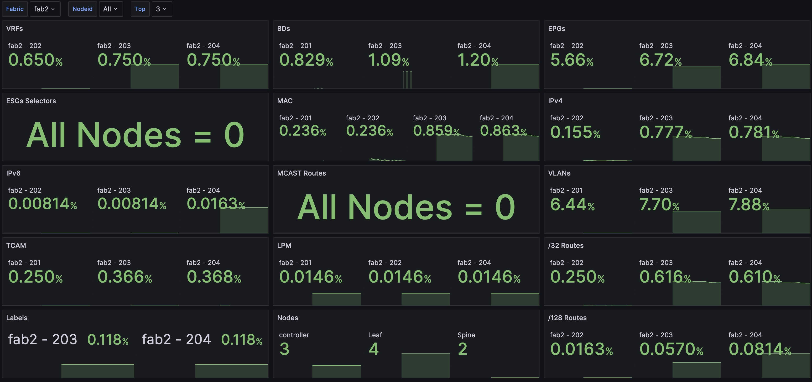
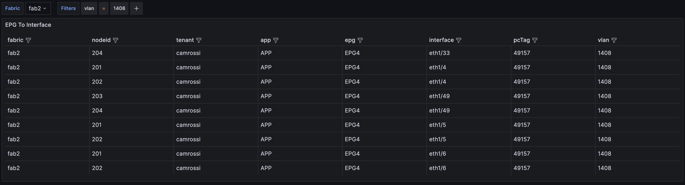
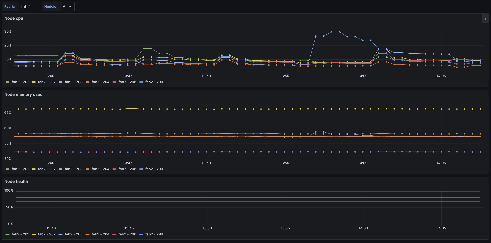
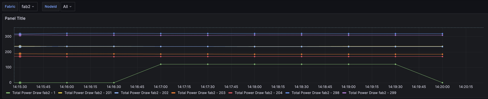
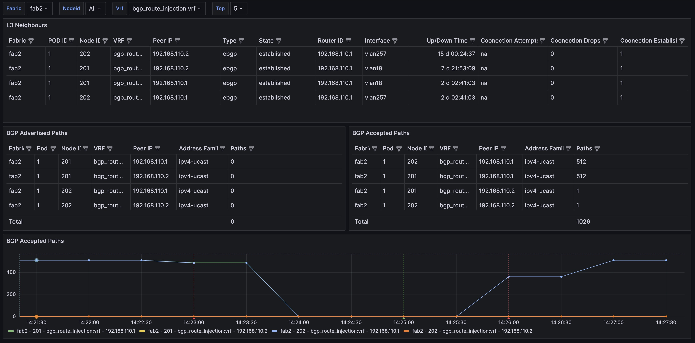
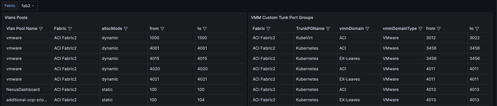

# Overview
Here you can find the code that was used in the `DEVNET-2210 - Grafana Dashboards for ACI Monitoring, an Open-Source approach to in depth visibility`. This session will eveolve with time so will these examples

# Environment 
 
This examples assumes that all the components used are running on top of a Kubernetes Cluster. The Kubernetes cluster used for this examples provides the following:
- [Longhorn Persistent Storage](https://longhorn.io)
- [NGINX Ingress Controller](https://kubernetes.github.io/ingress-nginx)
- [The kube-prometheus-stack](https://github.com/prometheus-community/helm-charts/tree/main/charts/kube-prometheus-stack)
- The PODs on the cluster (specifically ACI-Exporter) have IP connectivity to the APICs to execute the required APIs call

If the above requirements are met you should be able to deploy this demo by:
- updating the `fabrics` section in the [aci-exporter-deployment](aci-exporter-deployment.yaml)
- Adding an `additionalScrapeConfigs` in your Prometheus configuration as show in the [kube-prometheus-stack-values](kube-prometheus-stack-values.yaml) example

Note: In case you want to run aci-exporter standalone you can use the `aci-exporter-standalone.yaml` file instead
# Grafana Dashboards
You can find the following dashboards in the [Grafana Dashboards](grafana_dashboards) folder

## Capacity Dashboard
Visualize the fabric and switch capacity and track utilisation over time.

## EPG Explore
Maps an EPG to a Port/VLAN/VXLAN encapsulation.

## Node Details
Tracks Node CPU/Memory and Health over time.

## Node Interfaces
Tracks Node Interface TX/RX Usage over time and display which interfaces are UP/Down

## Nodes Power Usage
Tracks Node Power Usage Over Time

## Routing Protocols
Tracks BGP and OSPF Received and Advertised routes, the BGP Accpeted Paths Time series is also enabled with [Alerting](grafana_dashboards/routes_alerting.yaml)

## VLANs
Simple visualization of all the VLAN Pools and VMM Custom Trunk Ports
